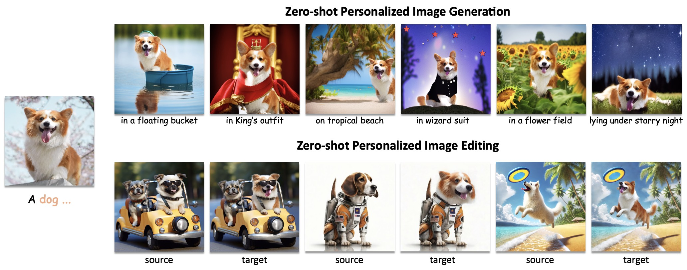
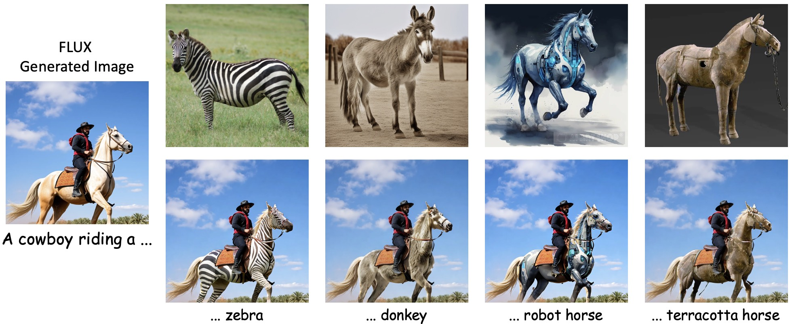

<div align="center">
<h1>EZIGen: Enhancing zero-shot personalized image generation with precise subject encoding and decoupled guidance</h1>
<div>
    <a href='https://zichengduan.github.io' target='_blank'>Zicheng Duan<sup>1</sup></a>;
    <a href='https://scholar.google.com/citations?user=uOii3uEAAAAJ&hl=zh-CN' target='_blank'>Yuxuan Ding<sup>2</sup></a>;
    <a href='https://scholar.google.com/citations?hl=zh-CN&user=tlhShPsAAAAJ' target='_blank'>Chenhui Gou<sup>3</sup></a>;
    <a href='https://www.linkedin.com/in/ziqin-zhou-6408051b0/?originalSubdomain=au' target='_blank'>Ziqin Zhou<sup>1</sup></a>;
    <a href='https://www.ethansmith2000.com/' target='_blank'>Ethan Smith<sup>4</sup></a>;
    <a href='https://scholar.google.com/citations?hl=en&user=Y2xu62UAAAAJ&view_op=list_works&sortby=pubdate' target='_blank'>Lingqiao Liu<sup>1,*</sup></a>
</div>
<sup>1</sup>AIML, University of Adelaide |
<sup>2</sup>Xidian University |
<sup>3</sup>Monash University |
<sup>4</sup>Leonardo.AI 


[](https://arxiv.org/abs/2409.08091)
[]([https://arxiv.org/abs/2409.08091](https://zichengduan.github.io/pages/EZIGen/index.html))
[]([https://arxiv.org/abs/2409.08091](https://github.com/huggingface/diffusers))

</div>


# Abstract
Zero-shot personalized image generation models aim to produce images that align with both a given text prompt and subject image, requiring the model to effectively incorporate both sources of guidance. However, existing methods often struggle to capture fine-grained subject details and frequently prioritize one form of guidance over the other, resulting in suboptimal subject encoding and an imbalance in the generated images. In this study, we uncover key insights into achieving high-quality balances on subject identity preservation and text-following, notably that 1) the design of the subject image encoder critically influences subject identity preservation, and 2) the text and subject guidance should take effect at different denoising stages. Building on these insights, we introduce a new approach, EZIGen, that employs two main components: a carefully crafted subject image encoder based on the pretrained UNet of the Stable Diffusion model, following a process that balances the two guidances by separating their dominance stage and revisiting certain time steps to bootstrap subject transfer quality. Through these two components, EZIGen achieves state-of-the-art results on multiple personalized generation benchmarks with a unified model and 100 times less training data.


# Overall Structure


# Installation
Clone this repo
```
git clone git@github.com:ZichengDuan/EZIGen.git
cd EZIGen
```

Prepare Conda environment
```
conda create -n ezigen python=3.10 -y && conda activate ezigen
```

Install PyTorch
```
pip install torch==2.0.1 torchvision==0.15.2 torchaudio==2.0.2 --index-url https://download.pytorch.org/whl/cu118
```

Build Diffusers from source
```
wget https://github.com/huggingface/diffusers/archive/refs/tags/v0.30.1.zip
cd diffusers-0.30.1
pip install . && cd .. && rm v0.30.1.zip
```

Install remaining dependencies
```
pip install -r requirements.txt
```


# Inference
We provide inference code for both subject-driven generation tasks and subject-driven image editing. Exemplary results can be found in the `outputs` folder.

## Download pre-trained checkpoints
Download the checkpoint(`checkpoint-200000.zip`) from [Google Drive](https://drive.google.com/file/d/1uucz9IQFT2NbwLvazdnOX2vAROn-0nxU/view?usp=sharing), unzip it to your local folder.


Please first turn to `config/infer_config.yaml` to assign a correct checkpoint folder path (e.g. `checkpoint-200000/`).
## Personalized image generation
The script for subject-driven generation and human content generation is provided in `infer_generation.sh`:
```
# infer_generation.sh
python infer.py \
    --config configs/infer_config.yaml \
    --guidance_scale 7.5\
    --seed 3154 \
    --split_ratio 0.4 \
    --infer_steps 50 \
    --sim_threshold 0.99 \
    --target_prompt "a dog in police outfit" \
    --subject_prompt "a dog" \
    --subject_img_path "example_images/subjects/dog6.png" \
    --output_root "outputs/" \
    # --num_interations 6
```
Some explanations for the arguments:
1. `split_ratio=0.4` means that we leave the last 40% of timesteps for Appearance Transfer, the first 60% steps for Layout Generation Process. the value ranges from 0 to 1 in which large value indicates more Appearance Transfer.

2. `sim_threshold` is the CLIP similarity threshold for autostop. `subject_prompt` acts as a placeholder, however, it's always recommended to type in the correct class name of the subject image for best subject feature extraction. 

3. `# --num_interations 6` is by default set to -1 to give way to the autostop mechanism (with a minimum of 3 and maximum of 10 iterations), however, you can uncomment this line and assign the desired iteration number.

Some subjects are presented in `example_images/subjects`.

## Personalized image editing
```
# infer_editing.sh
python infer.py \
    --config configs/infer_config.yaml \
    --guidance_scale 7.5\
    --seed 3154 \
    --split_ratio 0.4 \
    --infer_steps 50 \
    --sim_threshold 0.99 \
    --target_prompt "a woman" \
    --subject_prompt "a woman" \
    --subject_img_path "example_images/subjects/lifeifei.png" \
    --output_root "outputs/" \
    --foreground_mask_path example_images/source_images_with_masks/woman_mask.png \
    --source_image_path example_images/source_images_with_masks/woman.png \
    --do_editing
    # --num_interations 6
```
Some explanations for the arguments:
1. `source_image_path`: the path to the source RGB image for editing.

2. `foreground_mask_path`: the path to a 3-channel mask with foreground as (255, 255, 255) and background as (0, 0, 0), indicating the source image area for editing, should be the same height and width as the source image.

Some input examples are presented in `example_images/source_images_with_masks`.

## Integration with off-the-shelf image generators
The user can simply take a generated image from any off-the-shelf image generator and edit it with `infer_edit.sh`, example results from FLUX are shown below:



# Training
You can also start you own training following the instructions below: 

## Prepare training datasets
Download YoutubeVIS2019 dataset (training split) following this link: https://competitions.codalab.org/competitions/20128#participate-get_data

Download COCO2014 dataset (train/val splits) following this link: https://cocodataset.org/#download

Extract the data to local folders and configure the corresponding path in `configs/train_config.yaml`

## Start training
After dataset preparation, you can then simply start DDP training with HuggingFace Accelerator:
```
sh train.sh
```
Alternatively, you can also run the training using plain python on a single GPU:
```
python train.py --config configs/train_config.yaml
```
The checkpoint folders (e.g. checkpoint-5000) and tensorboard log will be automatically saved to the `output_dir`, which in turn can be used to do the inference. 

# Training details
In default setting, with 200k samples, the training takes about 4 hours on 8 A100-40G GPUs, and 26 hours on 1 A100-40G GPU, with batch size equals to 1 on each device. The provided checkpoint is trained on a single GPU, thus having a checkpoint post fix '200000', while if trained on multiple devices, the checkpointing post fix would be `num_samples / num_GPUs`.


# TODO List
- [x] Demo pages
- [x] Inference code and checkpoint
- [x] Training code

# Acknowledgements
Thanks [AnyDoor](https://github.com/ali-vilab/AnyDoor) for providing the YoutubeVIS dataset scripts, shout out to this great work!

#  Citation
If you find this codebase useful for your research, please cite as follows:
```
@article{duan2024ezigen,
  title={EZIGen: Enhancing zero-shot personalized image generation with precise subject encoding and decoupled guidance},
  author={Duan, Zicheng and Ding, Yuxuan and Gou, Chenhui and Zhou, Ziqin and Smith, Ethan and Liu, Lingqiao},
  journal={arXiv preprint arXiv:2409.08091},
  year={2024}
}
```
