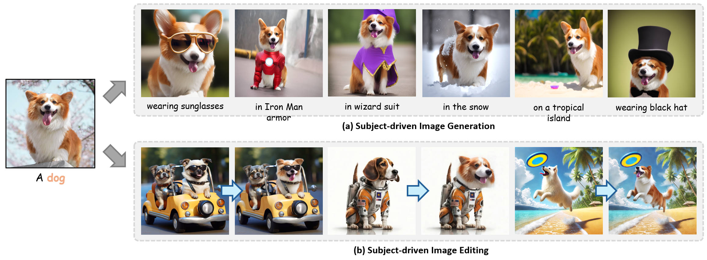

<div align="center">
<h1>EZIGen: Enhancing zero-shot subject-driven image generation with precise subject encoding and decoupled guidance</h1>
<div>
    <a href='https://zichengduan.github.io' target='_blank'>Zicheng Duan<sup>1</sup></a>;
    <a href='https://scholar.google.com/citations?user=uOii3uEAAAAJ&hl=zh-CN' target='_blank'>Yuxuan Ding<sup>2</sup></a>;
    <a href='https://scholar.google.com/citations?hl=zh-CN&user=tlhShPsAAAAJ' target='_blank'>Chenhui Gou<sup>3</sup></a>;
    <a href='https://www.linkedin.com/in/ziqin-zhou-6408051b0/?originalSubdomain=au' target='_blank'>Ziqin Zhou<sup>1</sup></a>;
    <a href='https://www.ethansmith2000.com/' target='_blank'>Ethan Smith<sup>4</sup></a>;
    <a href='https://scholar.google.com/citations?hl=en&user=Y2xu62UAAAAJ&view_op=list_works&sortby=pubdate' target='_blank'>Lingqiao Liu<sup>1,*</sup></a>
</div>
<sup>1</sup>AIML, University of Adelaide |
<sup>2</sup>Xidian University |
<sup>3</sup>Monash University |
<sup>4</sup>Leonardo.AI 

[](https://arxiv.org/abs/2409.08091)
[]([https://arxiv.org/abs/2409.08091](https://zichengduan.github.io/pages/EZIGen/index.html))
[]([https://arxiv.org/abs/2409.08091](https://github.com/huggingface/diffusers))



</div>

# TODO List
- [x] Demo pages
- [x] Inference code and checkpoint
- [ ] Training code and data loader
- [ ] Huggingface demo

# Installation
Prepare Conda environment
```
conda create -n ezigen python=3.10 -y && conda activate ezigen
```

Install PyTorch
```
pip install torch==2.0.1 torchvision==0.15.2 torchaudio==2.0.2 --index-url https://download.pytorch.org/whl/cu118
```

Install Diffusers
```
wget https://github.com/huggingface/diffusers/archive/refs/tags/v0.30.1.zip
cd diffusers-0.30.1
pip install -e ".[torch]" && cd .. && rm v0.30.1.zip
```

Install remaining dependencies
```
pip install -r requirements.txt
```
# Checkpoints
Download the checkpoint(`checkpoint-200000.zip`, ~6.5GB) from [Google Drive](https://drive.google.com/file/d/1IEymR4Mk44SsL1eqAbgHXe5LBYL7ud81/view?usp=sharing), unzip it to your local folder.

# Inference
We provide inference code for both subject-driven generation tasks and subject-driven image editing. Exemplary results can be found in the `outputs` folder.

Please first turn to `config/infer_config.yaml` to assign a correct checkpoint folder path (e.g. `checkpoint-200000/`).
## 1. Subject-Driven Generation & Human Content Generation
The script for subject-driven generation and human content generation is provided in `infer_generation.sh`:
```
# infer_generation.sh
python infer.py \
    --config configs/infer_config.yaml \
    --guidance_scale 7.5\
    --seed 3154 \
    --split_ratio 0.4 \
    --infer_steps 50 \
    --sim_threshold 0.99 \
    --tar_prompt "a dog in police outfit" \
    --sub_prompt "a dog" \
    --sub_img_path "example_images/subjects/dog6.png" \
    --output_root "outputs/" \
    # --num_interations 6
```
Some explainations to the arguments:
1. `split_ratio=0.4` means that we leave the last 40% timesteps for Appearance Transfer, the first 60% steps for Layout Generation Process. the value ranges from 0 to 1 in which large value indicates more Appearance Transfer.

2. `sim_threshold` is the CLIP similarity threshold for autostop. `sub_prompt` acts as a place holder, however, it's always recommended to type-in the correct class name of the subject image for best subject feature extraction. 

3. `# --num_interations 6` is by default set to -1 to give way to autostop machanism (with a minimum of 3 and maximum of 10 iterations), however you can uncomment this line and assign the desired iteration number.

Some subjects are presented in `example_images/subjects`.

## 2. Subject-Driven Editing
```
# infer_editing.sh
python infer.py \
    --config configs/infer_config.yaml \
    --guidance_scale 7.5\
    --seed 3154 \
    --split_ratio 0.4 \
    --infer_steps 50 \
    --sim_threshold 0.99 \
    --tar_prompt "a woman" \
    --sub_prompt "a woman" \
    --sub_img_path "example_images/subjects/lifeifei.png" \
    --output_root "outputs/" \
    --foreground_mask_path example_images/source_images_with_masks/woman_mask.png \
    --source_image_path example_images/source_images_with_masks/woman.png \
    --do_editing
    # --num_interations 6
```
Some explanations to the arguments:
1. Similar to `--sub_prompt`, `--tar_prompt` is also a placeholder now as the editing process doesn't require text prompt.

2. `source_image_path`: the path to the source RGB image for editing.

3. `foreground_mask_path`: the path to a 3-channel mask with foreground as (255, 255, 255) and background as (0, 0, 0), indicating the source image area for editing, should be the same height and width as the source image.

Some input examples are presented in `example_images/source_images_with_masks`.

# Acknowledgements
This project refer some of the code from [AnyDoor](https://github.com/ali-vilab/AnyDoor), shout out to this great work!

#  Citation
If you find this codebase useful for your research, please cite as follows:
```
@article{duan2024ezigen,
  title={EZIGen: Enhancing zero-shot subject-driven image generation with precise subject encoding and decoupled guidance},
  author={Duan, Zicheng and Ding, Yuxuan and Gou, Chenhui and Zhou, Ziqin and Smith, Ethan and Liu, Lingqiao},
  journal={arXiv preprint arXiv:2409.08091},
  year={2024}
}
```
