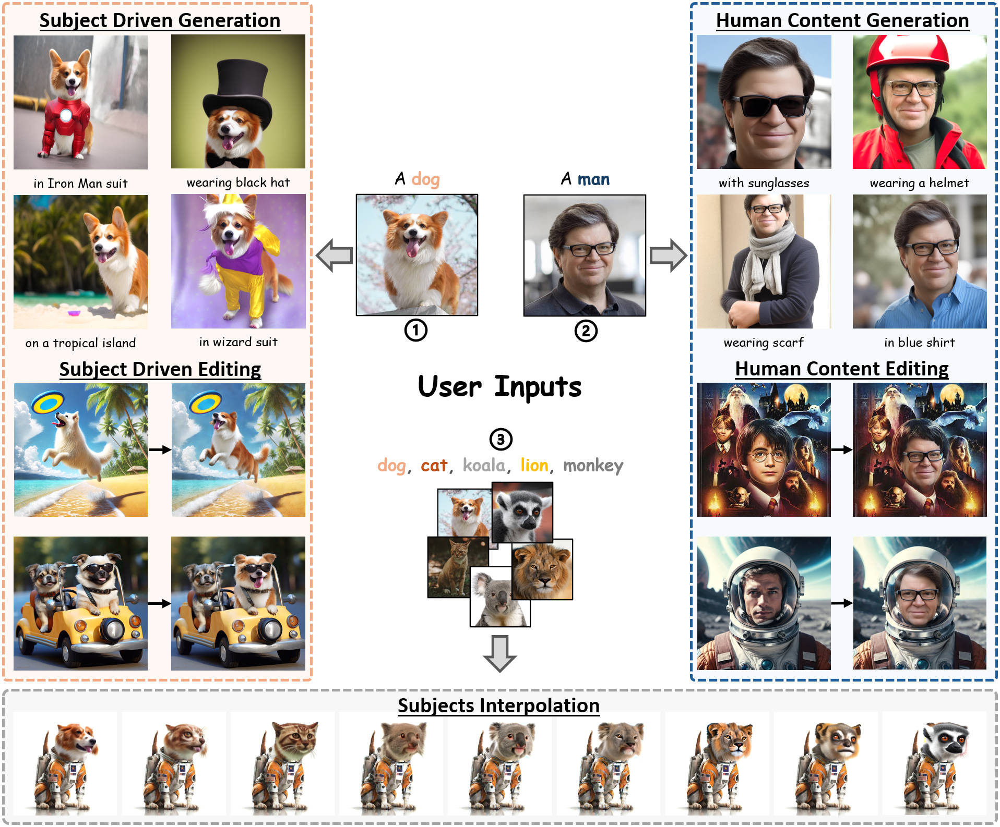

# EZIGen: Enhancing zero-shot subject-driven image generation with precise subject encoding and decoupled guidance [[arXiv](https://arxiv.org/abs/2409.08091)]

This repository contains the **official** PyTorch implementation of the paper [EZIGen: Enhancing zero-shot subject-driven image generation with precise subject encoding and decoupled guidance]([https://arxiv.org/abs/2311.10093](https://arxiv.org/abs/2409.08091)). 

## TODO List
- [x] Demo Pages
- [ ] Huggingface Demo
- [ ] Code Release
- [ ] Checkpoints

